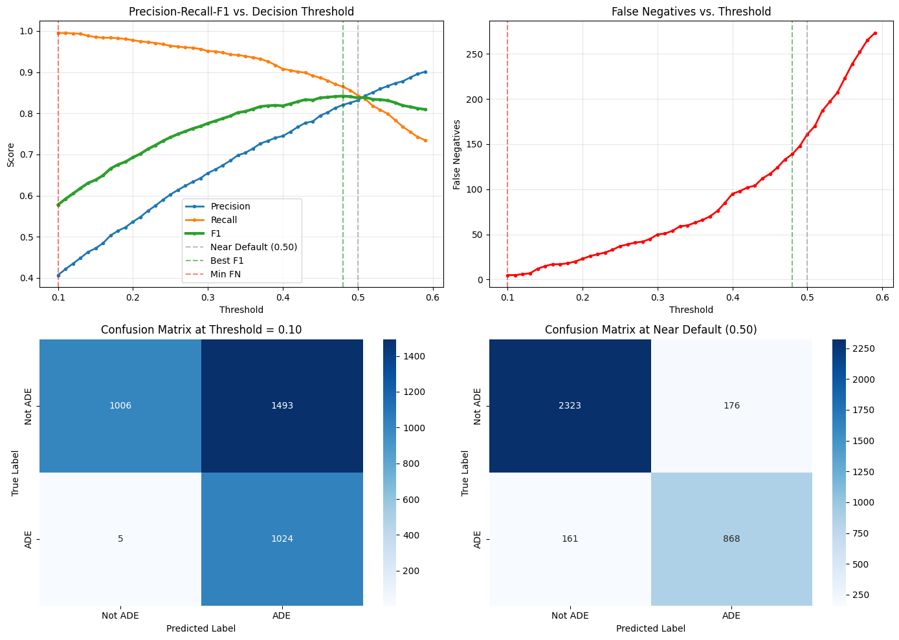
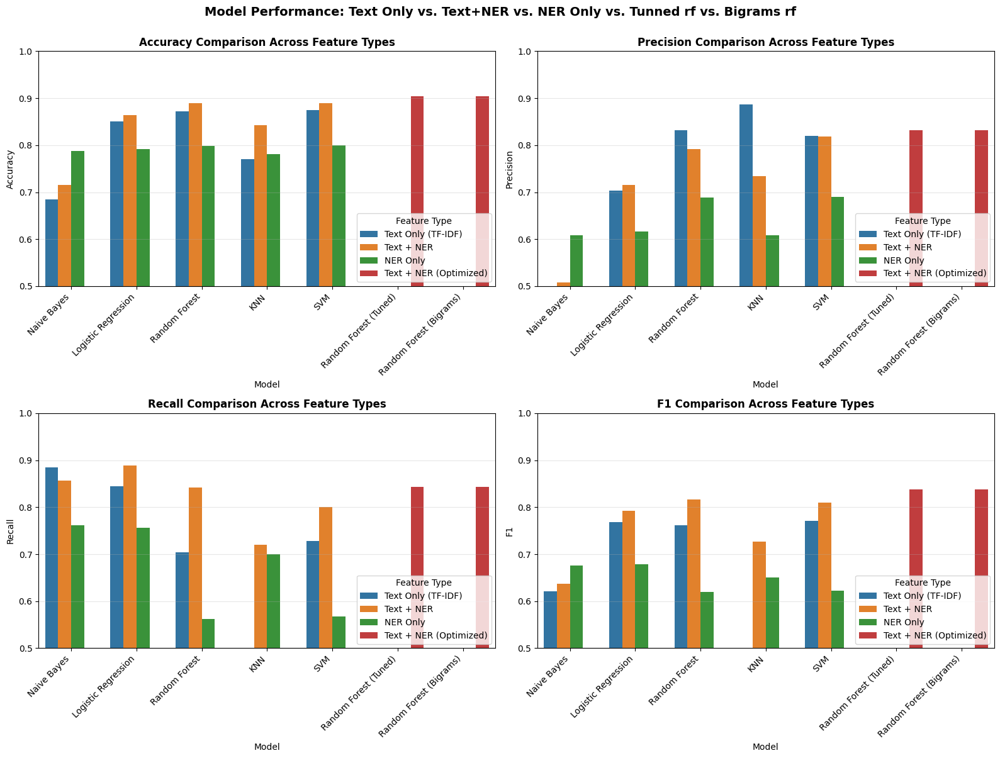
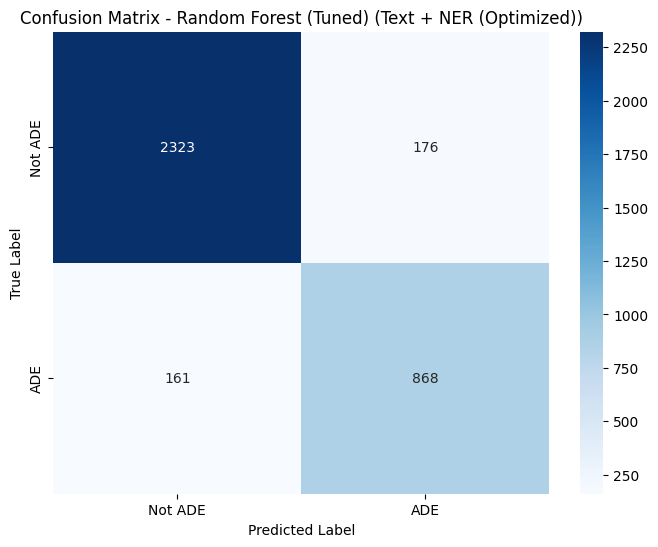
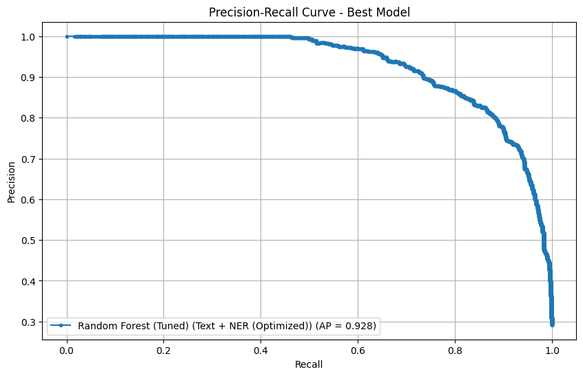
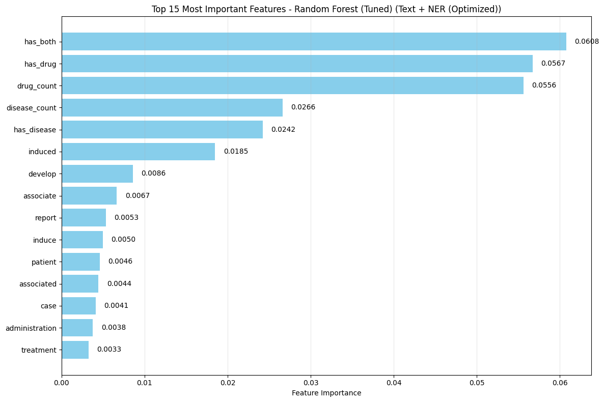
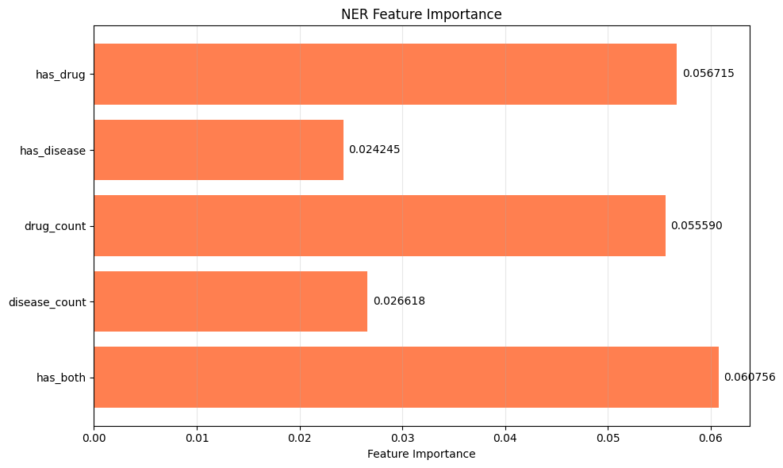
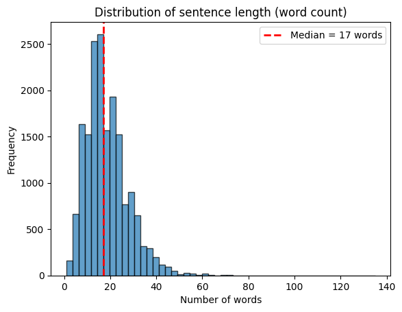

# 💊 Pharmacovigilance — Detecting Adverse Drug Events in Free Text

> **An NLP pipeline that classifies clinical free-text snippets as Adverse Drug Events (ADEs) — fusing TF-IDF with biomedical NER (scispaCy BC5CDR) for drugs and diseases.**


---

## 📌 Overview

Pharmacovigilance — monitoring drug effects after market release — depends on catching **Adverse Drug Events (ADEs)** from heterogeneous text: clinical notes, case reports, patient forums, social media. Manual review doesn't scale.

This project builds an **end-to-end NLP system** that:
1. **Classifies** whether a free-text sentence describes an ADE
2. **Extracts** implicated drugs (chemicals) and conditions (diseases) using biomedical NER

The result is a **triage layer** that prioritizes which reports human reviewers should look at first — high-recall by design to favor catching ADEs over avoiding false positives.

---

## 📊 Dataset

| Property | Value |
|---|---|
| **Source** | [HuggingFace `SetFit/ade_corpus_v2_classification`](https://huggingface.co/datasets/SetFit/ade_corpus_v2_classification) |
| **Rows** | 23,516 sentences |
| **Class balance** | 70.8% non-ADE / 29.2% ADE |
| **Loading** | Automatic via `datasets.load_dataset(...)` — no manual download |

---

## 📈 Results

The tuned **Random Forest + TF-IDF + NER-features** model:

| Operating point | Threshold | Precision | Recall | F1 | Avg. Precision |
|---|:-:|:-:|:-:|:-:|:-:|
| **Balanced (default)** | 0.48 | 82.0% | 86.5% | **0.842** | **0.928** |
| **High-recall triage** | 0.10 | (lower) | **99.5%** | — | — |

> The high-recall operating point catches **99.5% of ADEs** at the cost of more false positives (1,493) — a sensible trade for pharmacovigilance where missing an ADE is far more expensive than reviewing a non-ADE.

---

## 📊 Results in Pictures

### Threshold-tuning dashboard
The single image that drives the operating-point decision: Precision / Recall / F1 across thresholds, false-negatives vs threshold, and confusion matrices at both the high-recall (0.10) and near-default (0.50) settings.


### Model comparison across feature types
Naive Bayes, Logistic Regression, Random Forest, KNN, and SVC — each evaluated on *Text Only (TF-IDF)*, *Text + NER*, and *NER Only* feature sets, plus the tuned and bigram-augmented Random Forest variants.


### Confusion matrix — best model
Tuned Random Forest on Text + NER (Optimized) at the near-default threshold.


### Precision-recall curve — best model
Average Precision = **0.928**.


### Feature importance — top 15
NER-derived features (`has_both`, `has_drug`, `drug_count`, `disease_count`, `has_disease`) dominate the top of the table, validating the TF-IDF + NER `FeatureUnion` design.


### NER-only feature importance
Focused view on just the five engineered NER features.


### Sentence-length distribution (EDA)
Median ADE-corpus sentence is 17 words — informs the choice of TF-IDF max-features and bigram cutoff.


---

## 🛠️ Methodology

1. **EDA** — class balance, sentence length, lexical overlap between classes
2. **Preprocessing** — lowercasing, POS-aware WordNet lemmatization, stopword removal
3. **Biomedical NER** — `scispaCy` **`en_ner_bc5cdr_md`** extracts CHEMICAL and DISEASE entities; visualized with `displacy`
4. **Feature engineering** — TF-IDF + Count vectorizers, **NER-derived count features** fused via `FeatureUnion`
5. **Classification** — Multinomial NB, Logistic Regression, KNN, SVC, Random Forest; `GridSearchCV` with stratified K-fold CV; `class_weight='balanced'`
6. **Threshold tuning** — precision/recall curve to pick the operating point
7. **Evaluation** — classification report, confusion matrix, PR curve, average precision

---

## 🧪 Tech Stack

| Layer | Tools |
|---|---|
| **Data** | HuggingFace `datasets`, `pandas` |
| **NLP preprocessing** | `nltk` (POS-aware lemmatization), `re` |
| **Biomedical NER** | `scispacy` + `en_ner_bc5cdr_md` |
| **Vectorization** | `sklearn.feature_extraction.text` (TF-IDF, Count) |
| **Modeling** | `scikit-learn` (LR, NB, KNN, SVC, RF), `GridSearchCV` |
| **Viz** | `matplotlib`, `seaborn`, `spacy.displacy` |

---

## 📂 Repository Structure

```
pharmacovigilance-nlp/
├── notebooks/
│   └── pharmacovigilance.ipynb        # full EDA + modeling pipeline
├── scripts/
│   └── setup.sh                       # installs scispaCy model + NLTK data
├── docs/
│   ├── Pharmacovigilance_Report.md
│   ├── Pharmacovigilance_Report.docx
│   ├── Project_Proposal.pdf
│   └── Final_Presentation.pptx
├── requirements.txt
├── LICENSE
└── README.md
```

---

## 🚀 Run It Locally

```bash
git clone https://github.com/ferozobaid/pharmacovigilance-nlp.git
cd pharmacovigilance-nlp
python -m venv .venv && source .venv/bin/activate
pip install -r requirements.txt
bash scripts/setup.sh                  # scispaCy BC5CDR model + NLTK resources
jupyter lab notebooks/pharmacovigilance.ipynb
```

---

## 🔭 Future Improvements

- **Transformer backbone** — fine-tune BioBERT / PubMedBERT and compare against the TF-IDF + NER baseline
- **Span-level extraction** — predict the (drug, adverse-effect) tuple, not just sentence-level ADE / non-ADE
- **Active learning** — surface the most-uncertain sentences for human labeling each week
- **Calibration** — Platt / isotonic so threshold choice is interpretable as probability
- **Production-style API** — FastAPI wrapper + Dockerfile for batch + single-document scoring

---

## 👤 Author

**Feroz Obaid Khan** — Master of Management Analytics, McGill University · Group 1 project
🔗 GitHub: [@ferozobaid](https://github.com/ferozobaid)

## 📜 License

Code: MIT — see [LICENSE](LICENSE). Dataset: ADE Corpus v2, redistributed by SetFit on HuggingFace.
